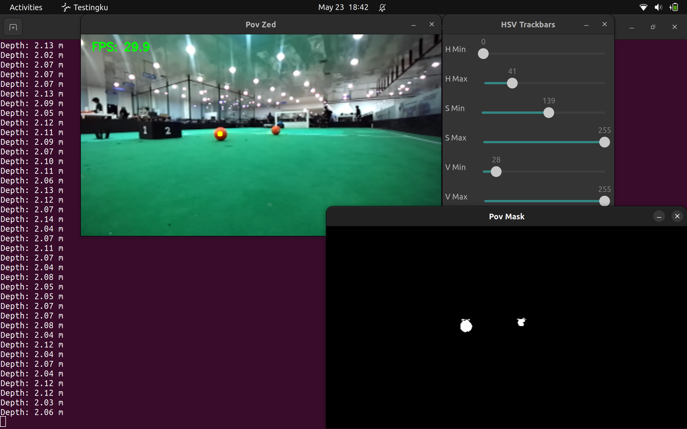
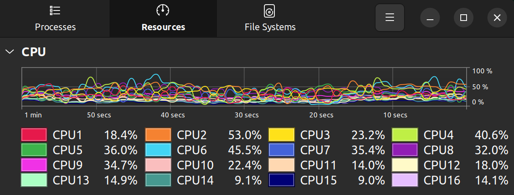

## Features

- Access ZED frames via ZED Open Capture API

- Color-based object detection with HSV filtering

- Depth estimation at object center

- CPU-only processing

### Requirements

- OpenCV ≥ 4.x

- ZED Open Capture SDK

- CMake ≥ 3.10

### Build & Run

    git clone https://github.com/ichsanyudika/Zed-Segment_OC-API.git
    cd Zed-Segment_OC-API
    mkdir build && cd build
    cmake ..
    make
    ./testingku

### Result

